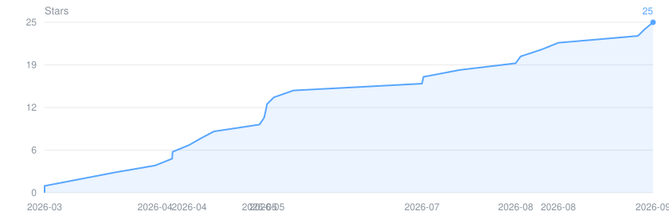
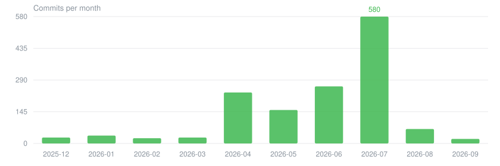

# Q1menG Client

<p align="center">
   
</p>

<p align="center">
  A project to rebuild a customised client based on DDNet / TaterClient
</p>

<p align="center">
  <a href="https://github.com/wxj881027/QmClient/actions/workflows/build.yml"></a>
  <a href="https://github.com/wxj881027/QmClient/actions/workflows/nightly.yml"></a>
  <a href="https://github.com/wxj881027/QmClient/releases/latest"></a>
  <a href="https://github.com/wxj881027/QmClient/stargazers"></a>
  <a href="LICENSE-QMCLIENT.md"></a>
</p>

> 📄 This document is available in <a href="README_zh.md">中文</a></p>

## 📝 Project Overview

Q1menG Client is a customised client built upon DDNet and TaterClient.\
The aim is to provide a more modern UI experience, a wider range of configurable visual effects, and more user-friendly day-to-day features, whilst maintaining compatibility with the core gameplay.

> 🤖 **AI agents / contributors**: workflow rules (commit, PR, release, build) live in [`AGENTS.md`](AGENTS.md). Start there.

## 📥 Download

Prebuilt packages are published on the [Releases](https://github.com/wxj881027/QmClient/releases/latest) page.

| Platform | Package |
| --- | --- |
| Windows | `QmClient-windows.zip` |
| Linux | `QmClient-ubuntu.tar.xz` |
| macOS | `QmClient-macOS.dmg` |
| Android | APK asset on the release page |

All four packages are built by [`build.yml`](https://github.com/wxj881027/QmClient/actions/workflows/build.yml); nightly builds come from [`nightly.yml`](https://github.com/wxj881027/QmClient/actions/workflows/nightly.yml). To build from source instead, see [Build](#-build).

## ✨ Features

- Smooth UI transitions and HUD animations
- Enhanced input and interaction experience
- More client configuration options and customisation settings
- Core capabilities that remain compatible with the DDNet ecosystem

## ❤️ Contributors

We would like to thank all contributors who have submitted code, reported issues and suggested improvements for this project.

[](https://github.com/wxj881027/QmClient/graphs/contributors)

## 🚀 Build

### Windows

Use the repository wrapper so `cmake` always runs inside a configured MSVC developer environment, even from a normal PowerShell or `cmd.exe` session:

```bat
qmclient_scripts/cmake-windows.cmd -S . -B cmake-build-release
qmclient_scripts/cmake-windows.cmd --build cmake-build-release --target game-client -j 14
```

### macOS / Linux / already-initialised developer shell

```sh
cmake -S . -B cmake-build-release
cmake --build cmake-build-release --target game-client -j 14
```

## ✅ Test

### Windows

```bat
qmclient_scripts/cmake-windows.cmd --build cmake-build-release --target run_cxx_tests
qmclient_scripts/cmake-windows.cmd --build cmake-build-release --target run_rust_tests
qmclient_scripts/cmake-windows.cmd --build cmake-build-release --target run_tests
```

### macOS / Linux / already-initialised developer shell

```sh
cmake --build cmake-build-release --target run_cxx_tests
cmake --build cmake-build-release --target run_rust_tests
cmake --build cmake-build-release --target run_tests
```

## 📊 Project Activity

Both charts are generated daily by [`readme-charts.yml`](.github/workflows/readme-charts.yml) and stored in this repository, so they load without depending on any third-party chart service.

> Commit counts cover QmClient contributors only. This repository is forked from DDNet and its Git history carries over 27,000 upstream commits going back to 2007, so an unfiltered activity chart would show upstream work rather than this project's.





## 🙏 Special Thanks

- All contributors to DDNet, Teeworlds, DDRace, TaterClient, Best Client, RClient and CactusClient
- Friends who have taken part in testing, provided feedback and offered inspiration
- Everyone who continues to contribute to the open-source community
- All donors – thank you

## 🏛 Credits

- Teeworlds — Magnus Auvinen
- DDRace — Shereef Marzouk
- DDNet — Dennis Felsing and contributors
- TaterClient — Community modifications
- Best Client — Community modifications
- [BetterLyrics](https://github.com/jayfunc/BetterLyrics) — [jayfunc](https://github.com/jayfunc)
- [Lyricify Lyrics Helper](https://github.com/WXRIW/Lyricify-Lyrics-Helper) — [XY Wang (WXRIW)](https://github.com/WXRIW)
- [163MusicLyrics](https://github.com/jitwxs/163MusicLyrics)
- [NeteaseCloudMusicApi](https://github.com/Binaryify/NeteaseCloudMusicApi)
- [qq-music-api](https://github.com/Rain120/qq-music-api)
- [QQMusicApi](https://github.com/jsososo/QQMusicApi)
- [LyricCapture](https://github.com/ElliottSilence/LyricCapture)
- [ntextcat](https://github.com/ivanakcheurov/ntextcat)
- [LyricParser](https://github.com/HyPlayer/LyricParser)

## 📜 License

This project is based on DDNet and TaterClient and uses **layered licensing**:

- **Inherited from upstream** — code and `data/` from Teeworlds, DDRace, DDNet and TaterClient, including this project's modifications to those files, remain under the zlib/libpng licence and CC BY-SA 3.0 respectively. Modified versions must be clearly attributed and must not misrepresent the identity of the original authors.
- **QmClient original code** — all rights reserved.
- **QmClient original assets** (`data/qmclient` chat emojis and logo) — [CC BY-NC-ND 4.0](https://creativecommons.org/licenses/by-nc-nd/4.0/): attribution, non-commercial, no derivatives.
- **Third-party material** — fonts, icon atlases (Phosphor Icons, MIT), ported music-platform code and dependencies keep their own licences.

The exact scope of each layer is defined in [`LICENSE-QMCLIENT.md`](LICENSE-QMCLIENT.md), which also states the intent behind the music-platform interoperability code; upstream notices and third-party attributions are collected in [`license.txt`](license.txt).

## 📮 Notes

This project is a personalised customisation and does not represent the official stance of DDNet or TaterClient.
